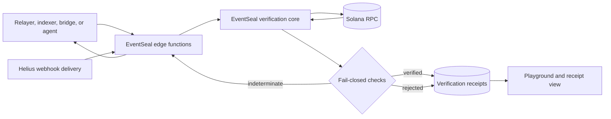

# EventSeal

**Verify Solana events before off-chain systems act on them.**

[](https://github.com/abhigyan1102/event-seal/actions/workflows/ci.yml)
[](./LICENSE)
[](#current-support)

EventSeal is an open-source verification layer for relayers, indexers, bridges, agents, and backend services that consume Solana events. It checks finalized transaction evidence before a log is allowed to trigger an irreversible off-chain action.

A transaction can emit convincing event bytes and still fail. EventSeal prevents consumers from treating those bytes as committed state by verifying transaction finality, execution success, event identity, and the program invocation frame that produced the event.

## The problem

Many off-chain systems follow the same pattern:

1. Observe an event in transaction logs or a webhook payload.
2. Decode the event.
3. Release funds, update a ledger, or trigger another workflow.

The dangerous assumption is that an observed log proves successful execution. Solana retains transaction metadata and logs for failed transactions, so a consumer must inspect the complete finalized transaction and attribute the event to the correct program before trusting it.

EventSeal turns that evidence into one explicit verdict:

| Verdict         | Meaning                                                  | Recommended consumer behavior                  |
| --------------- | -------------------------------------------------------- | ---------------------------------------------- |
| `verified`      | All required checks passed.                              | Continue according to application policy.      |
| `rejected`      | Transaction evidence contradicts the request.            | Stop and record the reason code.               |
| `indeterminate` | Required evidence is missing, ambiguous, or unavailable. | Retry or escalate; never treat it as verified. |

## How EventSeal works



The verifier performs the following checks in order:

1. Fetch the full transaction with `finalized` commitment.
2. Confirm the signature status is finalized.
3. Require transaction metadata and `meta.err === null`.
4. Require complete transaction logs.
5. Reconstruct nested Solana program invocation frames.
6. Decode Anchor event data and match the expected discriminator.
7. Confirm the active emitter program matches the expected program ID.
8. Hash the event data and generate a deterministic receipt ID.

Any missing or ambiguous evidence fails closed as `indeterminate`.

## Project components

| Component             | Location                                                 | Responsibility                                                                        |
| --------------------- | -------------------------------------------------------- | ------------------------------------------------------------------------------------- |
| Verification SDK      | [`packages/sdk`](./packages/sdk)                         | Fetch finalized RPC evidence, attribute Anchor log events, and return typed verdicts. |
| Web application       | [`apps/web`](./apps/web)                                 | Submit verification requests and display evidence receipts.                           |
| Hosted functions      | [`functions`](./functions)                               | Expose verification, receipt lookup, and Helius webhook handlers on InsForge.         |
| Receipt database      | [`migrations`](./migrations)                             | Store deterministic verification receipts with server-only writes.                    |
| Demonstration program | [`programs/event-seal-demo`](./programs/event-seal-demo) | Produce matching successful and failed Anchor events for adversarial testing.         |
| Transaction fixtures  | [`tests/fixtures`](./tests/fixtures)                     | Hold reproducible RPC evidence for verifier tests.                                    |

## SDK usage

Install the repository dependencies and build the SDK:

```bash
npm install
npm run build --workspace @eventseal/sdk
```

Call `verifyEvent` with a transaction signature, cluster, expected program ID, and Anchor discriminator:

```ts
import { verifyEvent } from "@eventseal/sdk";

const result = await verifyEvent({
  signature: "5UfDuX...",
  cluster: "mainnet-beta",
  expectedProgramId: "YourProgram111111111111111111111111111111",
  event: {
    format: "anchor-log",
    discriminator: "3f17c7d4d6763a2b",
  },
  commitment: "finalized",
});

if (result.verdict !== "verified") {
  throw new Error(`Event not trusted: ${result.reasonCode}`);
}

console.log(result.receiptId, result.event);
```

The discriminator must be the first eight bytes of the Anchor event encoding, represented as 16 lowercase hexadecimal characters.

### Result shape

```ts
interface VerificationResult {
  verdict: "verified" | "rejected" | "indeterminate";
  reasonCode: VerificationReasonCode;
  reason: string;
  signature: string;
  cluster: "mainnet-beta" | "devnet" | "testnet";
  commitment: "finalized";
  slot?: number;
  expectedProgramId: string;
  receiptId?: string;
  event?: {
    eventPosition: number;
    emitterProgramId: string;
    eventDataHash: string;
  };
  evidence: Array<{
    check: string;
    passed: boolean;
    detail: string;
  }>;
}
```

See the [API reference](./docs/api-reference.md) for all request fields and reason codes.

## Deterministic receipts

EventSeal derives a receipt ID from immutable event evidence:

```text
cluster + signature + event position + emitter program + event-data hash
```

The resulting `es_<sha256>` identifier is stable across repeated webhook deliveries. The hosted verifier uses it as the primary key when storing a receipt, making delivery idempotent.

## Local development

Prerequisites:

- Node.js 20 or newer
- npm 10 or newer
- Rust and Cargo
- Solana CLI and Anchor 0.31.x when working with the demonstration program

```bash
git clone https://github.com/abhigyan1102/event-seal.git
cd event-seal
cp .env.example .env
npm install
npm run check
npm run dev
```

Vite prints the local web URL. The interface loads without backend credentials, but hosted verification requires valid `VITE_INSFORGE_URL` and `VITE_INSFORGE_ANON_KEY` values.

### Useful commands

| Command                   | Purpose                                                     |
| ------------------------- | ----------------------------------------------------------- |
| `npm run dev`             | Build the local SDK and start the web application.          |
| `npm run test`            | Run SDK unit tests.                                         |
| `npm run typecheck`       | Type-check all TypeScript workspaces.                       |
| `npm run build`           | Build the SDK, web application, and bundled edge functions. |
| `npm run check`           | Run type-checking, tests, and production builds.            |
| `cargo check --workspace` | Compile-check the Anchor demonstration program.             |

## Hosted functions

Function source imports the local SDK. `npm run build:functions` bundles each handler and the verification core into deployable ESM files under `functions/dist` while leaving InsForge's Deno `npm:` dependency external.

```bash
npm run build:functions
npx @insforge/cli link
npx @insforge/cli db migrations up --all
npx @insforge/cli functions deploy verify-event --file functions/dist/verify-event.js
npx @insforge/cli functions deploy get-receipt --file functions/dist/get-receipt.js
npx @insforge/cli functions deploy helius-webhook --file functions/dist/helius-webhook.js
```

The deployed functions are invoked through InsForge function slugs:

| Function         | Method | Purpose                                                                 |
| ---------------- | ------ | ----------------------------------------------------------------------- |
| `verify-event`   | `POST` | Verify one transaction event and persist any deterministic receipt.     |
| `get-receipt`    | `GET`  | Retrieve a receipt using the `receiptId` query parameter.               |
| `helius-webhook` | `POST` | Deduplicate Helius signatures, verify them, and persist their receipts. |

See [`functions/README.md`](./functions/README.md) for environment variables
and [`docs/insforge-deploy-runbook.md`](./docs/insforge-deploy-runbook.md) for
the deployment checklist, smoke checks, and non-secret deployment record.

## Demonstration program

The Anchor program exposes two instructions that emit the same `DemoEvent` payload:

- `emit_success` emits the event and returns successfully.
- `emit_then_fail` emits the event and deliberately returns an error.

This creates a controlled pair of transactions for proving that log bytes alone are insufficient verification evidence.

```bash
anchor build
anchor keys sync
anchor test
```

## Current support

| Capability                          | Behavior                                                             |
| ----------------------------------- | -------------------------------------------------------------------- |
| Legacy and versioned transactions   | Supported through JSON RPC with `maxSupportedTransactionVersion: 0`. |
| Finalized transaction status        | Required. Anything else returns `TX_NOT_FINALIZED`.                  |
| Failed transactions                 | Rejected with `TX_FAILED`.                                           |
| Anchor `emit!` log events           | Supported with nested invocation-frame attribution.                  |
| Anchor `emit_cpi!` events           | Returns `indeterminate` with `CPI_EVENT_UNSUPPORTED`.                |
| Duplicate deliveries                | Produce the same deterministic receipt ID.                           |
| Missing RPC data, metadata, or logs | Returns `indeterminate`; never `verified`.                           |

EventSeal verifies event commitment and attribution. It does not prove application-level correctness, replace Solana consensus verification, or audit downstream business logic.

## Repository structure

```text
event-seal/
├── apps/web/                  React and Vite verification interface
├── docs/                      Architecture, API, threat model, and invariants
├── examples/helius-webhook/   Helius integration notes
├── functions/                 InsForge edge-function source
│   └── _shared/               Shared verification and persistence path
├── migrations/                Receipt database migrations
├── packages/sdk/              Public TypeScript verification API
├── programs/event-seal-demo/  Anchor adversarial-event program
├── scripts/                   Reproducible build tooling
└── tests/fixtures/            Captured transaction evidence
```

## Security

EventSeal handles security-sensitive evidence and has not undergone an independent audit. Do not use it as the sole authorization layer for production fund movement without reviewing the implementation, testing it against your threat model, and operating a trusted RPC strategy.

Please report vulnerabilities through [GitHub private vulnerability reporting](https://github.com/abhigyan1102/event-seal/security/advisories/new).

## Contributing

Focused issues and pull requests are welcome. Changes to a verification invariant should include positive, negative, malformed-input, and unavailable-evidence tests.

## License

EventSeal is available under the [MIT License](./LICENSE).
