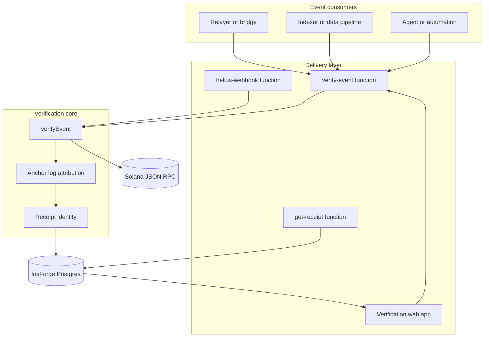
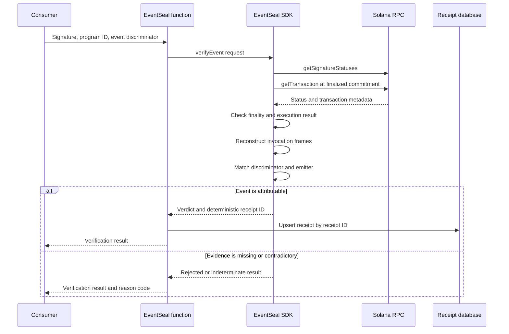

# EventSeal architecture

EventSeal has one verification core and thin delivery adapters. Direct SDK calls, hosted requests, and webhook deliveries all use the same fail-closed verifier.

## System view

## Verification flow

## Trust boundaries

### Webhook providers

A provider payload is a delivery mechanism, not proof. The Helius adapter extracts transaction signatures and sends every unique signature through the same RPC-backed verification path. Provider-parsed event fields are not accepted as evidence.

### Solana RPC

The verifier relies on the selected RPC endpoint for finalized transaction data. RPC errors, missing transactions, missing metadata, and unavailable logs return `indeterminate`. EventSeal is not a light client and does not independently prove consensus.

### Receipt storage

Receipt IDs are content-addressed from immutable evidence. The database permits public reads but reserves writes for server-side credentials. Repeated deliveries upsert the same primary key.

### Demonstration program

The Anchor program exists only to produce controlled successful and failed event transactions. It is not part of the production verification path.

The exact verification requirements are documented in [verification-invariants.md](./verification-invariants.md).
